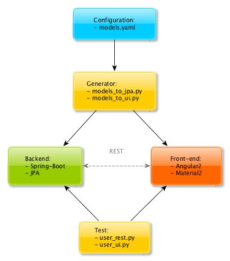

# DRY Super Framework

This project is a DRY principle implementation inspired by [Django](https://www.djangoproject.com/)
and [Swagger](https://swagger.io/), based on these parts:

* **Configuration:** using YAML and convention-over-configuration to define model metadata
* **Generator:** using Python/ruamel.yaml/Mako to generate JPA/Repository and UI from YAML
* **Backend:** using Java/Spring-Boot and JPA/Repository to perform the REST/CRUD operations with permissions
* **Front-end:** using TypeScript/Angular2/Material2 for the extensible administration UI
* **Test:** using Python/Requests/Selenium for REST/UI testing

## Tools
* **doc:**
[Atom](https://atom.io/) |
[Markdown](https://guides.github.com/features/mastering-markdown/) |
[yEd](https://www.yworks.com/products/yed)
* **Configuration:**
[YAML](http://www.yaml.org/)
* **Generator:**
[ruamel.yaml](http://yaml.readthedocs.io/) |
[Mako](http://www.makotemplates.org/)
* **Backend:**
[STS](https://spring.io/tools/sts) |
[Spring Boot](http://docs.spring.io/spring-boot/docs/current/reference/htmlsingle/) |
[Spring Data JPA](https://docs.spring.io/spring-data/jpa/docs/current/reference/html/) |
[Spring Data REST](http://docs.spring.io/spring-data/rest/docs/current/reference/html/)
* **Front-end:**
[Visual Studio Code](https://code.visualstudio.com/) |
[TypeScript](https://www.typescriptlang.org/) |
[Angular2](https://angular.io/) |
[Material2](https://material.angular.io/) |
[Angular CLI](https://cli.angular.io/)
* **Test:**
[Requests](http://docs.python-requests.org/) |
[Selenium](http://selenium-python.readthedocs.io/)

## MIT License
[https://opensource.org/licenses/MIT](https://opensource.org/licenses/MIT)
